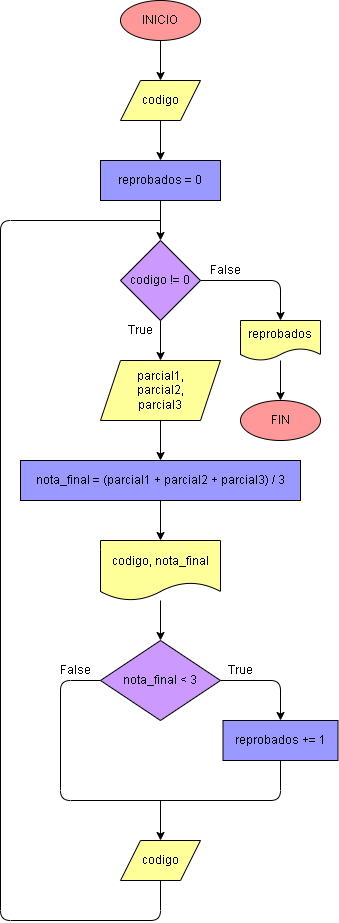

# Caso 1: 

Hacer el diagrama de flujo y el programa en Python que por cada estudiante lea el código y las 5 notas del periodo de una materia, y que calcule e imprima el código y la nota final de cada estudiante. No sabemos cuántos estudiantes son, pero después de la información del último, se introduce cero en el campo correspondiente al código, de modo tal que sirva como CENTINELA, para indicar cuándo terminan los datos de entrada. También se debe informar al final cuántos estudiantes perdieron la materia. (Ver código en archivo caso1-centinela.pdf)

## Diagrama de flujo

