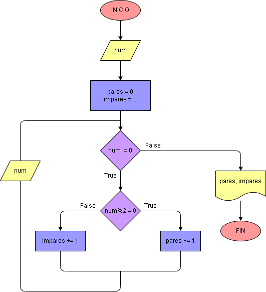

# Caso 2: 

Hacer el diagrama de flujo y el programa en Python que lea números enteros y positivos (uno en cada lectura) , y que averigüe e imprima cuantos son pares y cuántos son impares. Para terminar utilizaremos el registro centinela, cuando el valor del número leido sea cero. (Ver codigo en archivo caso2_centinela.pdf)

## Diagrama de flujo

